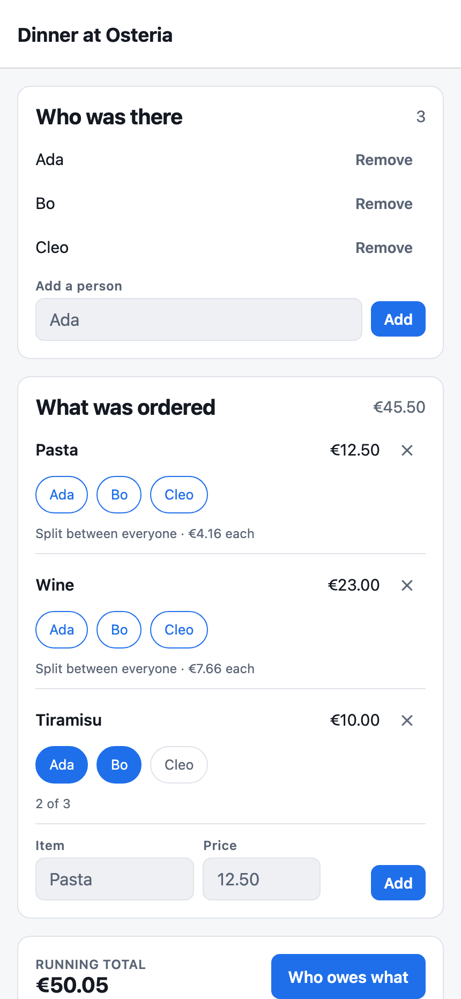
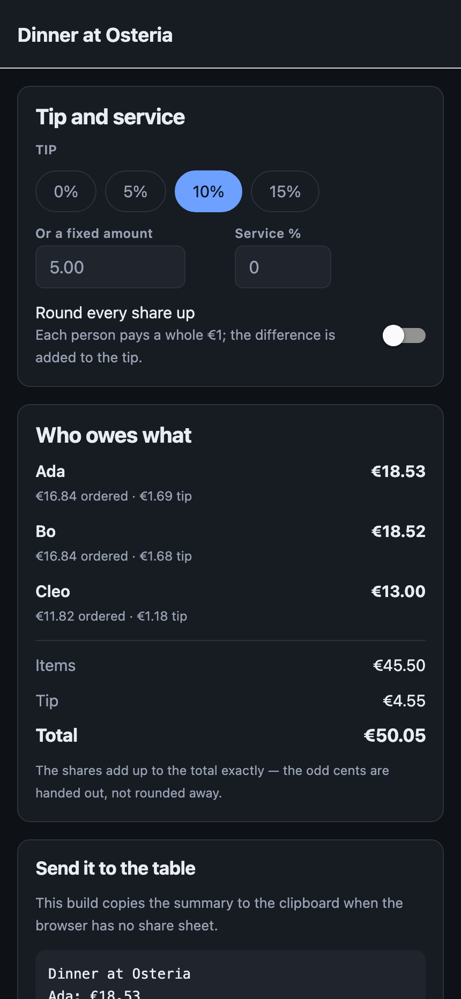

# Split Bill

Split a restaurant bill between friends: who ordered what, who shared what, tips
and rounding — and a total that always adds up to the cent.

<p>
  
  
</p>

One codebase, two targets: React Native on iOS and the same screens on the web.

## What it does

- **People and items.** Add who was at the table, add what was ordered, then tap
  the people who shared each dish. An item with nobody on it belongs to
  everyone, so the total is right while you are still typing the bill in.
- **A total that adds up.** Tips as a percentage or a fixed amount, an optional
  service charge, and an option to round every share up to a whole unit. The
  per-person shares always sum to exactly the bill — the odd cents are handed
  out, not rounded away.
- **History.** Past bills stay on the device, and one tap starts a new bill with
  the same company and none of the food.
- **Share.** The breakdown as plain text, through the system share sheet on a
  phone and the Web Share API — or the clipboard — in a browser.

Everything is local. No account, no server, no network calls at all.

## Money is integer cents, and the split is exact

The whole product rests on one guarantee: **`sum(shares) === total`**, always.
That is not a rounding convention, it is how the numbers are produced.

```ts
/**
 * Splits an amount into parts that sum to exactly `total`.
 *
 * Largest remainder: everyone gets the floor of their share, and the cents left
 * over go to the parts with the biggest fractional remainder.
 */
export function divide(total: Cents, weights: readonly number[]): Cents[]
```

Every stage uses it — an item across the people sharing it, then the service
charge and the tip across what each person actually ordered. Nothing is ever a
float: prices are parsed straight into cents and formatted back out only for
display. A test splits 2,000 random totals across up to eight people and 500
randomly shaped bills, and checks the sum every time.

## What is shared between iOS and the web, and what is not

Everything above the platform line is one file for both: the money maths, the
settlement, the store, all five screens, the theme, and every component in
`src/components/ui.tsx`. React Native's primitives render natively on a phone
and as DOM elements on the web, so there is no second implementation of the UI.

Three places genuinely differ, and each is a file or a branch rather than a
sprinkle of platform checks:

- **Sharing** — `src/lib/share.ts` opens the system sheet; `src/lib/share.web.ts`
  uses the Web Share API and falls back to the clipboard. The bundler picks the
  file by its `.web` extension, so neither implementation is aware of the other.
- **Confirming a destructive action** — `Alert.alert` on a phone, `window.confirm`
  in a browser, chosen with one `Platform.OS` check at the point of use.
- **Storage** — the same AsyncStorage API on both, but the web build prerenders
  in Node where there is no `window`, so the adapter answers `null` there
  instead of crashing the build.

The web target is not a courtesy port: it is how this project gets a link you
can open without a phone, and the CI build fails if a native-only dependency
creeps in without a web fallback.

## Running it

```bash
npm install

npm run ios          # iOS Simulator (needs Xcode)
npm start            # scan the QR code with Expo Go on a real phone
npm run web          # the same app in a browser
```

```bash
npm run lint
npm run typecheck
npm test             # 27 tests
npm run build:web    # static export into dist/
```

Node 22.

## Tests

Twenty-seven, split by what they protect:

- **The maths** — parsing prices, splitting an amount so it always adds up, and
  rounding a share up to a whole unit.
- **The settlement** — an item charged only to the people who shared it, tips by
  percentage and by amount, a service charge and rounding together, and the
  invariant checked across 500 generated bills.
- **The scenario, at the level the screens drive it** — create a bill, seat
  three people, add three items, split one between two of them, apply a tip and
  produce the message that goes into the chat. Plus removing a person without
  orphaning their items, and repeating the company without dragging last
  night's food along.

Both regressions introduced on purpose while writing them (a tip split evenly
instead of by what each person ordered, and a repeat that carried the items
over) were caught by the suite.

CI runs lint → typecheck → test → web build on every push.

## Deploy

`vercel.json` is committed: the web export, `dist` as the output, and a rewrite
so a link straight to a bill opens instead of 404ing.

```bash
npx vercel deploy --prod
```

There is no public link yet — the repository is private. Lighthouse on the local
production build reports **100 performance / 100 accessibility / 100 best
practices**.

## Known limits

- The bills live on one device. There is no sync, no accounts and no way to
  share a bill for someone else to edit — only the finished text.
- One currency, formatted for `en-GB`.
- Uneven splits (someone had two of something) are not modelled: an item is
  shared equally by the people on it.
